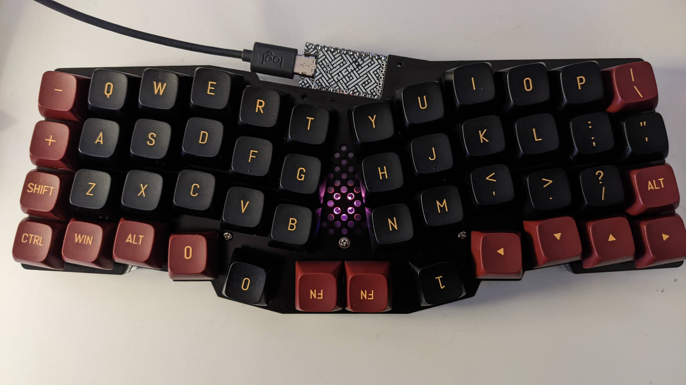
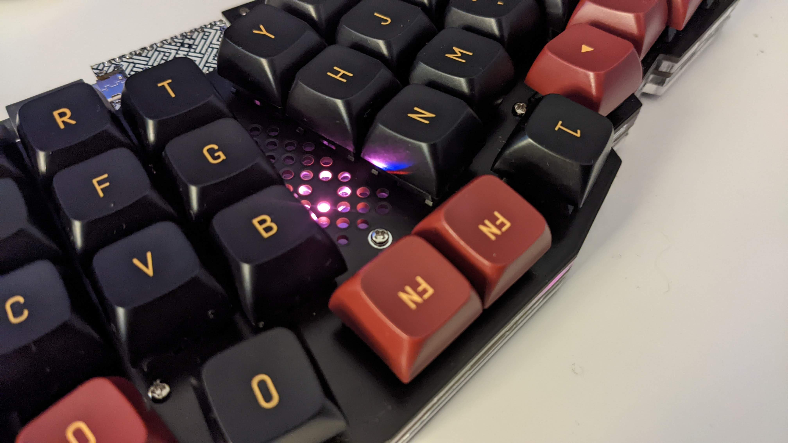
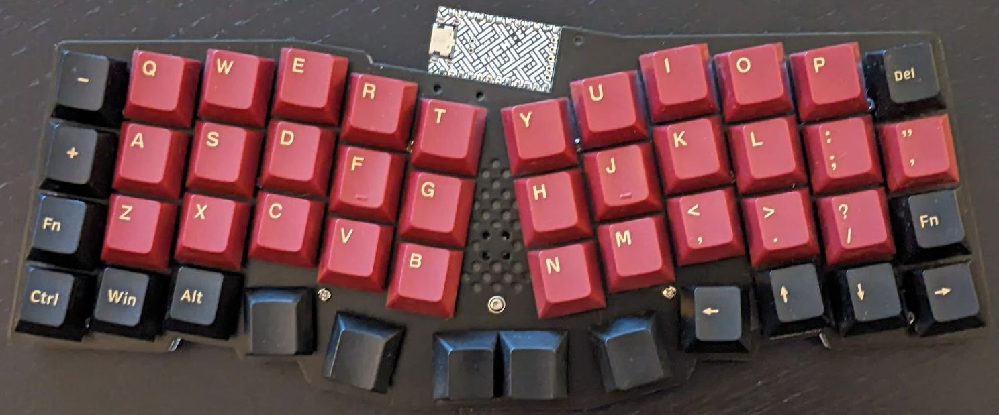

# REVIUNGDASH

## REVIUNGDASH47

  
  
  

The REVIUNGDASH47 is 47/8 key column staggered keyboard. Inspired by the Reviung41
(& ERGODASH) hence the name!

[REVIUNGDASH47](reviungdash47/)

## REVIUNGDASH52

  
  

The REVIUNGDASH52 is a 52 key column staggered keyboard. Based on the
REVIUNGDASH47 but with a larger thumb cluster.

[REVIUNGDASH52](reviungdash52/)
