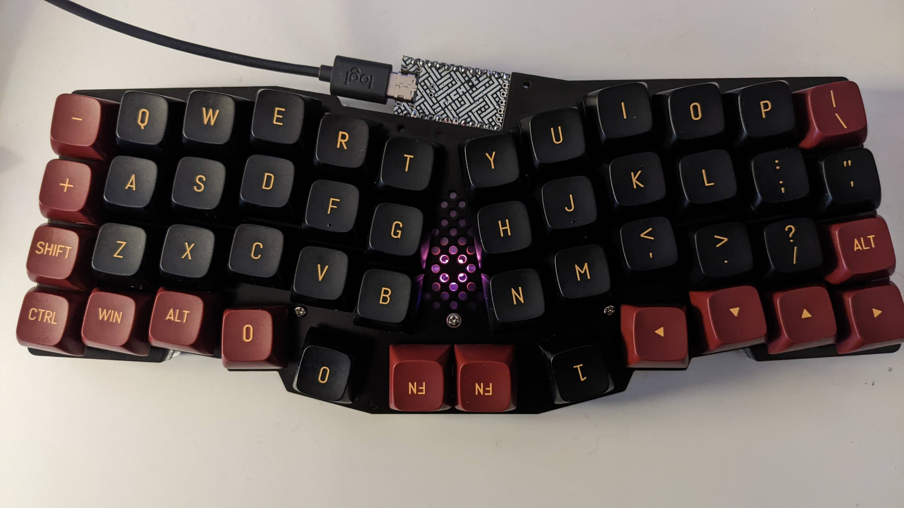
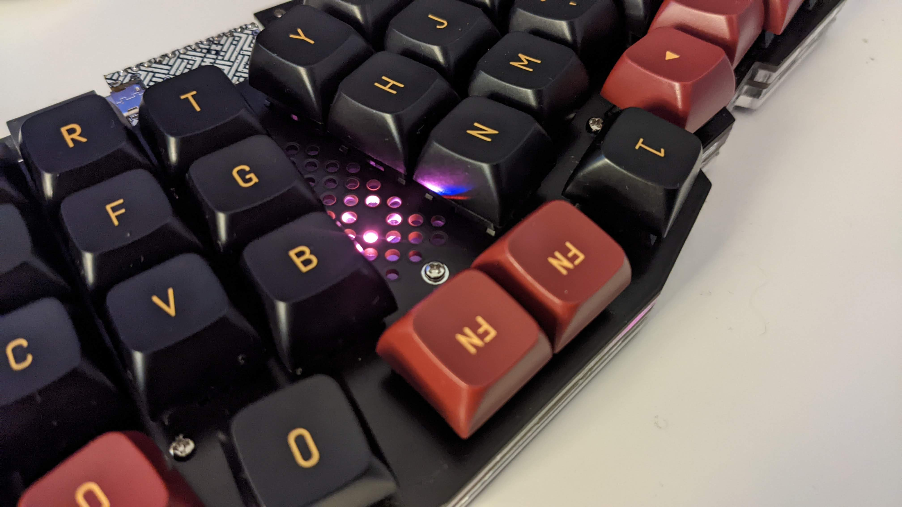
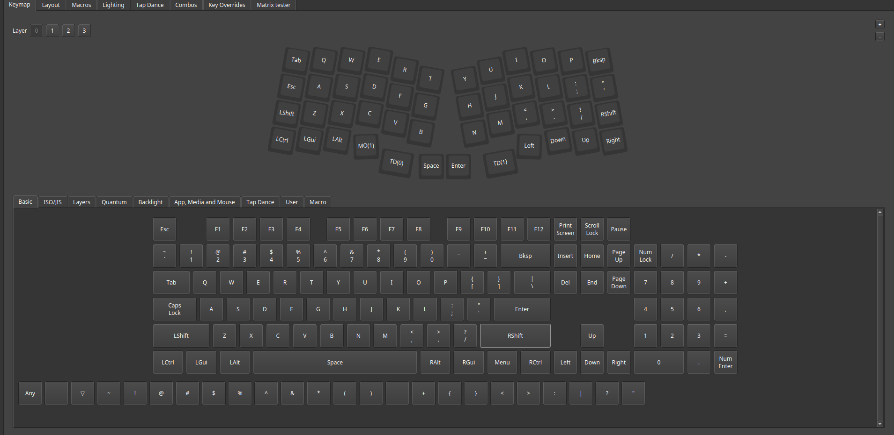
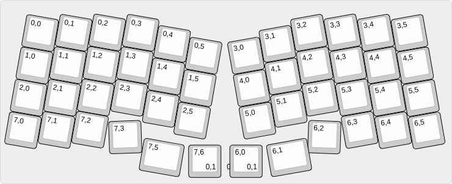
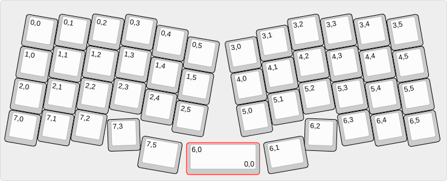

# REVIUNGDASH

## REVIUNGDASH47

  
  

The REVIUNGDASH47 is 47/8 key column staggered keyboard. Inspired by the Reviung41
(& ERGODASH) hence the name!

Differences between the REVIUNG41:

* Addition of 6 corner keys
* Spacebar can be either a single switch or have 2x 1u switches
(inspired by the Ergodash which allows choosing the thumb keys)
* The RGB led on the front was rerouted to be first (as I would rather have 1
led and don't use the underglow - this allows to not have to solder all the other
leds but they can be if wanted later)

## Parts list  

PCB --- 1 piece  
Top plate [PCB] --- 1  
Silicon sheet --- 1 sheet  
Middle acrylic plate (top) --- 1  
Middle acrylic plate (bottom) --- 1  
Bottom plate --- 1 piece  
ProMicro protective plate --- 4 types  
Acrylic spacer --- 3 pieces  
Spacer --- 11 pieces  
M2 screw 4mm --- 22 pcs  
M2 screw 10mm --- 3 pcs  
M2 nut --- 3 pcs  
Rubber feet --- 6 pieces  
Diode [1N4148 SMD] --- 47/8 pieces  
PCB socket for switch --- 47/8 pcs  
Tact switch --- 1 piece  
LED [WS2812B] --- 11 pieces  
Stabilizer --- 1 piece  

ProMicro --- 1  
Con through (spring pin header 12P) --- 2  
MX compatible key switch --- 47/8 pcs  
Keycaps (1u + optional 2u if a double space bar is used)
MicroUSB cable --- 1  

## Firmware

Based on QMK

* Works with VIAL UI (layout provided)
* QMK Config (layout provided - has not been tested)

[Vial-QMK Firmware](https://github.com/tumler/vial-qmk/tree/Add_ReviungDash47)

  
  
  

## Build Guide

* See Reviung41 guide

[Build guide](https://reviung.com/build-guide/391/)  
