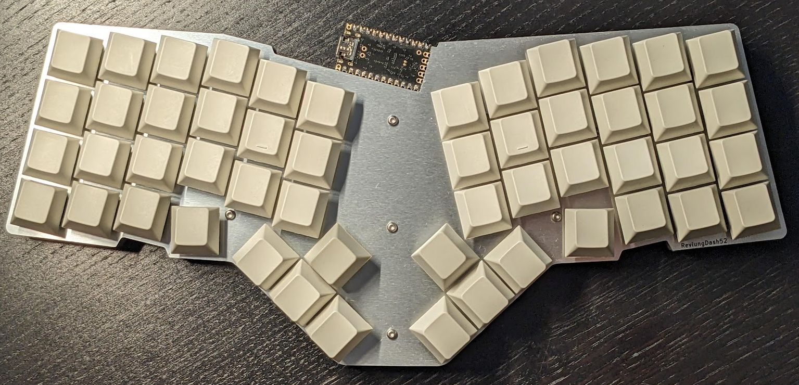
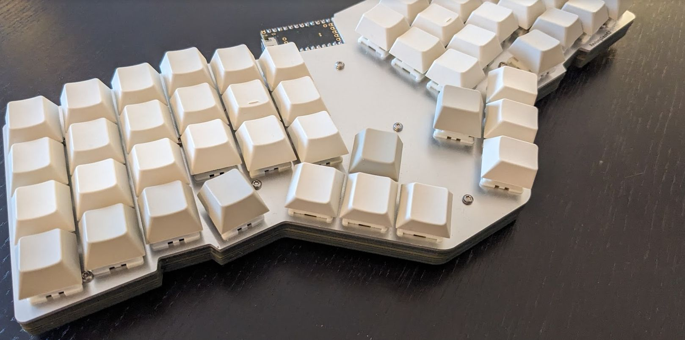

# REVIUNGDASH52

  
  

The REVIUNGDASH52 is a 52 key column staggered keyboard. Based on the
REVIUNGDASH47 but with a larger thumb cluster.

[REVIUNGDASH52](reviungdash52/)
The REVIUNGDASH47 is 47/8 key column staggered keyboard. Inspired by the Reviung41
(& ERGODASH) hence the name!

Differences between the REVIUNGDASH47:

* Addition of a thumb cluster - inspired by the Ergodash cluster
    * 2 Extra thumb keys each side
* Left / Right sides further apart to accomodate thumb cluster, while remaining
as close as possible to remain small yet comfortable
* Every layer designed as PCBs (could easily be swapped out for acrylic / metal layers)

## Parts list  

* Top plate (PCB / Metal) 1.6mm --- 1
* Inner w/ MCU Cutout 1.2mm --- 4
* PCB 1.6mm --- 1
* Inner without MCU Cutout 1.6mm --- 1
* Bottom Plate 1.6mm --- 1

* MCU (ProMicro or RP2040 that has the same dimensions as a ProMicro)

* Using Magnets as feet / standoffs:
* M2 Screw 5mm --- 22 pieces
* M2 Screw 6mm --- 4 pieces (to attach the magnets)
* Through-hole M3 Magnets --- 4 pieces (+ as many as you need for the height you want for the standoffs)

* No standoffs (or using another system):
* M2 Screw 5mm --- 26 pieces

* Rubber Feet --- 6 pieces (might require different sizes on the 2 internal legs - see photos)

* Diode [1N4148 SMD] --- 52 pieces  
* MX compatible key switch --- 52 pieces  

* Keycaps
* USB-C Cable --- 1

## Firmware

Based on QMK

* Works with VIAL UI (layout provided)
* QMK Config (layout provided - has not been tested)

[Vial-QMK Firmware](https://github.com/tumler/vial-qmk/tree/Add_ReviungDash_Keyboards)

## Build Guide

* See Reviung41 guide

[Build guide](https://reviung.com/build-guide/391/)  
